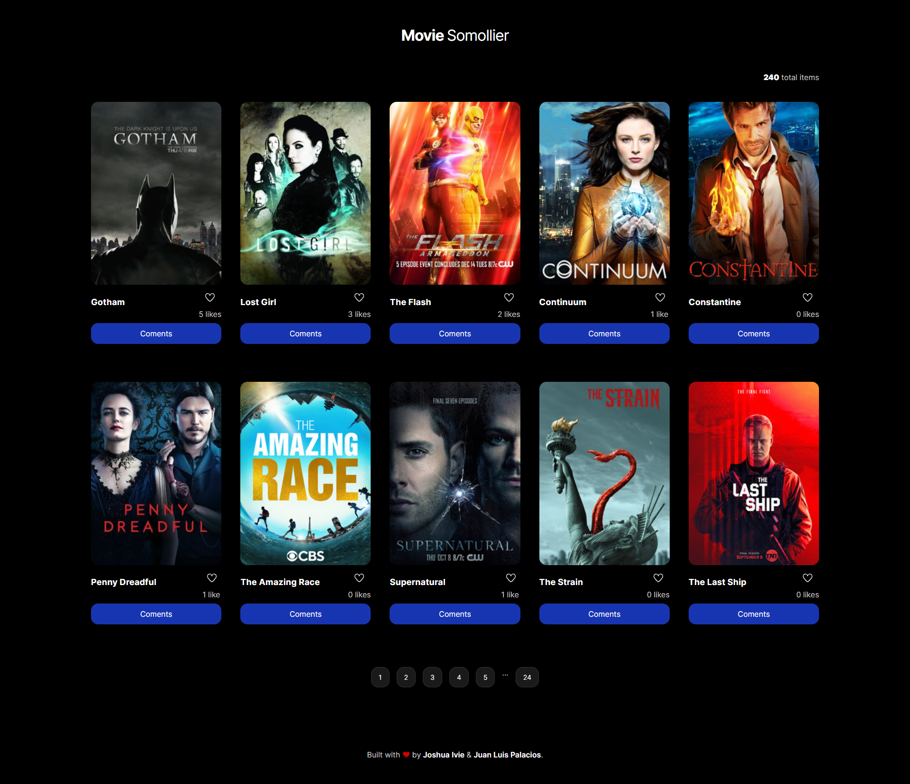
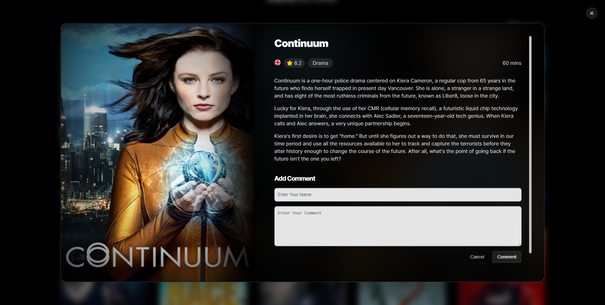

# Movie Somollier




> The Movie Somollier app, is an platform on which movie lovers can share thier thoughts about their favorite movies and series. Data is sourced from the the incredible [TVMaze](https://www.tvmaze.com/api) open API. Those guys are awesome! After we retrieve data from the movie data from TVMaze the application stores user interactions (Likes and Comments) on a seperate interaction API.

> You can check out the live link below to get a feel of the application. Improvements are also welcome. You can follow the instructions below to set up the project on your local machine. Thanks for checking out this project. We hope you enjoy exploring it as much as we enjoyed building it.

## Live Demo

[Live Demo Link](https://joshuaivie.github.io/MovieSommelier/)

## Built With

- HTML
- CSS
- Javascript
- Webpack

## Getting Started

### Prerequisites

- Node
- NPM ( Node Package Manager )
- Git and Github Account

### Setup

- Run git clone on this project at the desired directory:
  ```
  git clone https://github.com/joshuaivie/MovieSommelier.git
  ```
  ```
  cd MovieSommelier
  ```
- Install dependencies

  ```
  npm install
  ```

- Start Webpack Server
  ```
  npm run start
  ```
- On your favourite browser go to http://localhost:8080/

### Tests

- **Webhint** linter -`npx hint .` on the root directory.
- **Stylelint** linter - `npx stylelint "**/*.{css,scss}"` on the root directory.
- **ESLint** linter - `npx eslint .` on the root directory.

## Authors

👤 **Joshua Ivie**

- GitHub: [@joshuaivie](https://github.com/joshuaivie)
- Twitter: [@joshuaivie\_](https://twitter.com/joshuaivie_)
- LinkedIn: [joshuaivie](https://linkedin.com/in/joshuaivie)

👤 **Juan Luis Palacios**

- GitHub: [@JuanLPalacios](https://github.com/JuanLPalacios)
- Twitter: [@JuanLuisPalac20](https://twitter.com/twitterhandle)
- LinkedIn: [LinkedIn](https://www.linkedin.com/in/juan-luis-palacios-p%C3%A9rez-95b39a228/)

## 🤝 Contributing

Contributions, issues, and feature requests are welcome!

Feel free to check the [issues page](https://github.com/joshuaivie/MovieSommelier/issues).

## Show your support

Give a ⭐️ if you like this project!

## 📝 License

This project is [MIT](./MIT.md) licensed.
